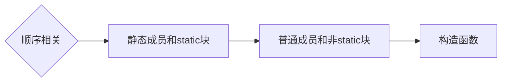
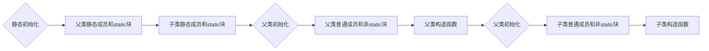

# java类

## java有哪些常用的类 {id="java_common"}
Java是一种广泛使用的编程语言，它提供了许多内置的类，这些类可以用于各种不同的任务和应用程序。
1. String类：String类是Java中最重要的类之一，它表示字符串。
2. System类：System类包含了一些有用的静态变量和常量，以及一些有用的方法，如输入/输出操作和控制台输入。
3. Math类：Math类包含了一些用于数学运算的静态方法和常量。
4. List接口和ArrayList、LinkedList类：List是一个接口，ArrayList和LinkedList是实现这个接口的常用类。它们都用于存储和操作有序的元素集合。
5. Set接口和HashSet、LinkedHashSet、TreeSet类：Set是一个接口，HashSet、LinkedHashSet和TreeSet是实现这个接口的常用类。它们都用于存储和操作无序的元素集合。
6. Map接口和HashMap、LinkedHashMap、TreeMap类：Map是一个接口，HashMap、LinkedHashMap和TreeMap是实现这个接口的常用类。它们都用于存储和操作键值对映射。
7. File类：File类用于表示文件路径名和文件操作。
8. Date类和LocalDate、LocalTime、LocalDateTime类：Date类是用于表示特定时间点的类，而LocalDate、LocalTime和LocalDateTime类是用于表示日期和时间的类。
9. Random类：Random类用于生成伪随机数。
10. Scanner类：Scanner类用于从各种输入源（如键盘）读取原始数据。
这只是Java中常用类的一部分，还有许多其他的类可以用于各种不同的任务和应用程序。

## java类的组成 {id="java_compose"}
1. 属性（成员变量）：属性用于存储对象的状态，也就是对象的数据。在类中，使用private关键字声明属性，然后在get和set方法中访问和修改这些属性。
2. 构造方法：构造方法是一种特殊的方法，用于创建并初始化对象。构造方法的名称必须与类名完全相同，且没有返回类型。
3. 方法（成员方法）：方法用于定义对象的行为。方法可以访问和修改对象的属性。
4. 块（Block）：块是一种特殊的代码结构，它可以包含在类定义中，并且在类加载时执行。常见的块包括静态块和实例化块。
5. 内部类：内部类是定义在另一个类中的类。Java支持三种类型的内部类：成员类、静态内部类和局部内部类。

## 类与对象的关系
总体分为依赖、关联、聚合和组合。
1. 依赖（Dependency）：一个类依赖于另一个类。这种关系表示一个类依赖于另一个类的定义，一般通过局域变量、方法的形参，或者对静态方法的调用体现。
2. 关联（Association）：关联是一种“拥有”的关系。表现在代码上，就是一个类包含另一个类的实例，通常表现为被关联类以类属性的形式出现在关联类的类定义中，也可以表现为关联类引用了一个类型为被关联类的全局变量。关联可以使单向的，也可以使双向的。
3. 聚合（Aggregation）：聚合是关联关系的一种，是强的关联关系。聚合是整体和个体之间的关系。
4. 组合（Composition）：组合关系是关联关系的一种，是比聚合关系强的关系。它要求普通的聚合关系中代表整体的对象负责代表部分对象的生命周期，组合关系是不能共享的。

## 什么是java类？ {id="java_1"}
1. Java类是面向对象编程中的一个基本概念。
2. 类是对象的抽象，它定义了对象的属性和方法。
3. 在Java中，类是一种用户自定义的数据类型，它定义了对象的结构和行为。
4. 通过类，我们可以创建具有相同属性和方法的对象的实例。

## 什么是java内部类？ {id="java_inner"}
Java中的内部类是一种特殊的类，它被定义在另一个类的内部。根据其作用域，Java中的内部类可以分为四种：
1. 静态内部类（Static Nested Class）：这种内部类与外部类是独立的，不需要创建外部类的实例就可以创建内部类的实例。静态内部类可以访问外部类的静态成员。
2. 实例内部类（Instance Nested Class）：这种内部类必须依赖于外部类的一个实例来创建。创建实例内部类的对象时，必须先创建外部类的对象。实例内部类可以访问外部类的所有成员，包括私有成员。
3. 局部内部类（Local Inner Class）：这种内部类定义在方法中，与方法的变量一样只有局部的作用域。局部内部类可以访问该方法的变量。
4. 匿名内部类（Anonymous Inner Class）：这种内部类没有名字，只能用于实现接口或者继承抽象类。匿名内部类可以继承一个已有类或实现一个接口，也可以不。

## 什么是java的抽象类？ {id="java_abstract"}
抽象类通常用于定义软件的抽象概念，如形状、动物等，这些概念可以有多种具体的实现方式。通过使用抽象类，我们可以定义这些概念共有的属性和行为，然后在子类中提供具体的实现。

### java抽象类的使用设计原则 {id="java_abstract_design"}
抽象类是面向对象设计原则中的重要概念，它有助于实现代码的抽象和封装，提高代码的可维护性和可扩展性。

> 更多参阅：[接口和抽象类的区别？](java-interface.md#java-abstract_difference)

## java中子类和父类相关方法的执行顺序

普通类初始化

继承体系初始化

