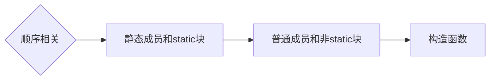
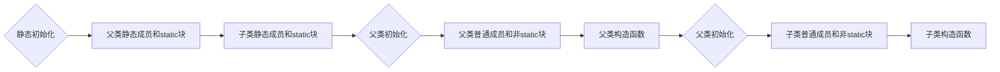

# java类

## 类的组成
由成员变量(属性)和成员方法组成，并且成员方法不需要static修饰

## java.lang.Math数学类
用来进行一些数学中的操作。该类为工具类,不需要创建对象,直接通过类名.方法名调用。
```Java
Math.abs(值);        //求值得绝对值
Math.max(值1,值2);    //比较两个值中较大的并返回
Math.min(值1,值2)     //比较两个值中较小的并返回
Math.random();      //返回一个0.0-1.0之间的随机数(不包括1.0),类型是double类型的
```

## java.util.Random随机数
```Java
Random r = new Random();// 调用无参构造函数创建对象
r.nextInt();            // 获得一个int取值范围内的随机数
r.nextInt(10);          // 获得一个0-9的随机数,不包括10
r.nextInt(6)+5;         // 获得一个5-10的随机数

```

## java.util.Date日期对象
```Java
Date date = new Date();//调用无参构造创建对象
//常用方法
date.getYear();//获得年,返回的是当前年数-1900的数值,如:今年是2016年,
则返回的是2016-1900,也就是116
date.getMonth();//获得月,返回的是0-11,0代表1月,11代表12月
date.getDate();//获得日
date.getDay();//获得市星期几,0-6,0表示星期天,1-6表示星期一到星期六
date.getTime();//返回自1970年1月1日后的毫秒数

```

## java.text.SimpleDateFormat日期格式化
```Java
// 调用有参构造,传递的是要展示的日期的格式
SimpleDateFormat sdf = new SimpleDateFormat("yyyy/MM/dd HH:mm:ss");
//常用方法
sdf.format(date);//返回一个构造函数中指定了格式的字符串
//根据构造函数中规定的格式传递一个字符串,返回一个Date对象
sdf.parse("2017/08/08 23:59:59");

```


## java中子类和父类相关方法的执行顺序

普通类初始化



继承体系初始化

