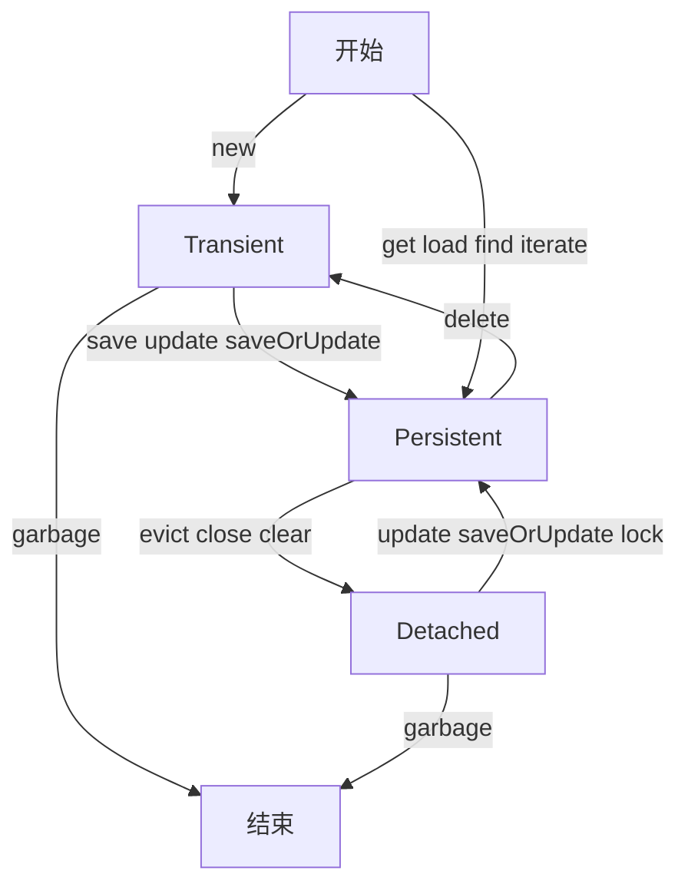
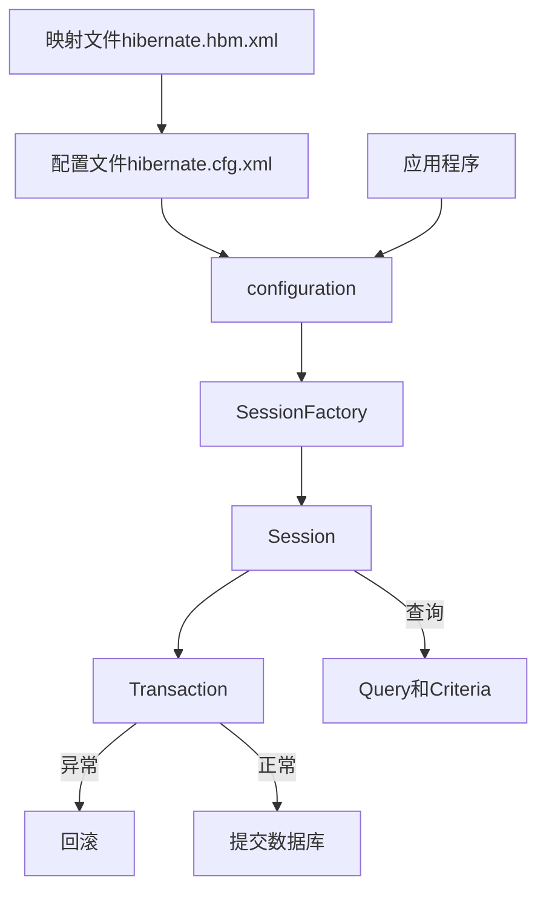

# hibernate

1. Hibernate有jdbc事务和JTA事务两种事务类型


## 什么是hibernate？ {id="hibernate_1"}
hibernate（冬眠）核心内容是ORM（Object Relation Mapping对象关系映射）。可以将对象自动的生成数据库中的信息，使得开发更加的面向对象。这样作为程序员就可以使用面向对象的思想来操作数据库，而不用关心繁琐的JDBC。所以，Hibernate处于三层架构中的D层（持久层）。

一句话概括：是对象持久化框架，其实就是实体类和数据库表建立关系，完成数据库编程

## 什么是hql？
1. HQL是Hibernate Query Language的缩写，即Hibernate查询语言。 HQL是一种面向对象的查询语言，它允许你使用面向对象的方式来查询数据库。
2. HQL与SQL语句非常类似，但是HQL的操作对象不是表，而是对象和它们的属性。Hibernate将HQL查询转换为传统的SQL查询，以便对数据库进行操作。
3. HQL查询提供了更加丰富和灵活的查询特性，因此Hibernate将其作为官方推荐的标准查询方式。

## hql注意点 {id="hql_1"}
1. HQL语句不支持insert操作。
2. HQL中没有表和字段的概念，只有类和属性的概念。
3. HQL中如果写成 from Teacher;则查询查询出来的是一个个Teacher类的对象。如果写成 select t.teacherName from Teacher t;则查询出来的是一个个String类型的teacherName.
4. 当确定返回一条记录时用query.uniqueResult()方法，如果返回多条记录使用query.list()方法。
5. Hibernate给?赋值从0开始，JDBC给?赋值从1开始。
6. Hibernate中既可以用?做占位符，也可以用 :变量名;变量名可以随便写，但要对应。
7. 通过query.setParameterList()方法给参数赋值一个集合。
8. 如果查询指定的多个属性时，查询结果中的每条信息都是一个对象数组，查询了几个属性，数组中就有几个元素，它们是一一对应的。
9. 可以通过new map()的方式将多个属性封装为一个map进行返回，之后根据key，取到对应的值。如map.get(key)
10. 可以通过给实体类添加带有参数的构造函数的方式来将返回的多个属性封装为一个实体对象。
11. setFirstResult():指明开始位置的下标
12. setMaxResults():指明要提取的条数
13. 调用query.executeUpdate()方法进行更新.
14. update/delete子句是hibernate3引入的新特性

## hibernate的生命周期 {id="hibernate_10"}



## hibernate两大核心配置文件 {id="hibernate_conf"}
1. hibernate.cfg.xml：这个文件是Hibernate的配置文件，它包含了Hibernate的一些全局配置信息，例如数据库连接信息、事务管理器和SessionFactory的配置等。Hibernate使用这个配置文件来初始化Hibernate运行环境。
2. hibernate.hbm.xml：这个文件是Hibernate映射文件的简称，它用于将Java对象映射到数据库表中。通过这个文件，Hibernate可以自动生成对应的SQL语句，实现Java对象与数据库表的双向转换。Hibernate映射文件通常与对应的Java类放在同一个包中，并使用相同的文件名，但扩展名为.hbm.xml。

## hibernate的三种状态 {id="hibernate_2"}
1. 临时状态（Transient）：也称为瞬时状态，用new创建的对象，它没有持久化，没有处于Session中，处于此状态的对象叫临时对象。例如，刚new出来的对象或者session执行了delete方法之后的对象都处于临时状态。此外，如果Session缓存被清空，那么原本处于持久化状态的对象也会变成临时状态。
2. 持久状态（Persistent）：对象已经持久化，并且加入到了Session缓存中。处于此状态的对象叫持久对象。例如，临时状态下的对象执行了save()方法，或者游离状态下的对象执行了update()、get()或load()方法之后，对象就会处于持久化状态。此状态下的对象，其数据会和数据库中的数据保持同步，任何一方发生改变，另一方都会跟着改变。
3. 游离状态（Detached）：也称为脱管状态，此状态中的对象为游离对象。游离对象表示该对象在数据库中有表示符（即该对象的id在数据库表中存在），但在Session中没有该对象。一般来说，当Session执行了close()、clear()、evict()等方法后，处于持久化状态的对象就会变成游离状态。另外，如果刚实例化的对象在数据库中有其主键，那么该对象也是游离状态。


## hibernate中的五大核心类和接口 {id="hibernate_core"}



Configuration实例是一个启动期间的对象，一旦SessionFactory创建完成它就被丢弃。
1. Configuration(类)：负责配置并启动hibernate。加载配置文件hibernate.cfg.xml文件中的配置信息，从而得到数据库连接、jdbc驱动、数据库dialect方言、用户名和密码
2. SessionFactory(接口)：负责初始化hibernate。通过configuration创建的sessionFactory，可以用来获得session。sessionFactory是线程安全的，里面保存了数据的配置信息和映射关系
3. Session(接口)：负责持久化对象的crud操作。它并不是HttpSession相当于jdbc中connection，不是线程安全的，避免多个线程共享一个session，是轻量级一级缓存。我们可以使用session来操作数据库负责保存、更新、删除、加载和查询对象。
4. Transaction(接口)：负责事务。我们一般使用Transaction来进行事务的管理commit（提交）和rollback（回滚）
5. Query和Criteria(接口)：负责执行各种数据库查询


## hibernate中两种事务的区别

1. JDBC事务由Connection管理，也就是说，事务管理实际上是在JDBC Connection 中实现。事务周期限于Connection的生命周期之内。      
2. JTA（Java Transaction API）事务管理则由 JTA 容器实现，JTA 容器对当前加入事务的众多Connection 进行调度，实现其事务性要求。JTA的事务周期可横跨多个JDBC Connection生命周期和多个Session。


```Java
# jdbc事务，必须在session.close()之前commit或者rollback
public void saveUser()   {
   Session session = sessionFactory.openSession();
   Transaction tx = session.beginTransaction();
   session.save(user);
   tx.commit();
   session.close();
} 

# jta事务
# commit和rollback可以在session.close()之后执行。
# 同时应该注意的一点是，事务是不能嵌套的。在使用jta的事务的情况下，如果要让一个事务跨越两个session，则必须在两个session的外层开始事务和完成事务。而不能再在session内部开始事务和完成事务。

public void saveUser()   {
   Session session = sessionFactory.openSession();
   Transaction tx = session.beginTransaction();
   session.save(user);
   session.close(); 
   Session session1 = sessionFactory.openSession();
   session1.save(user1);
   session.close();
   tx.commit();
}
```


## hibernate的运行原理 {id="hibernate_8"}
首先通过configuration去加载hibernate.cfg.xml这个配置文件。根据配置文件的信息去创建sessionFactory，sessionFactory是线程安全的，是一个session工厂，用来创建session。session是线程不安全的，相当于jdbc的connection。最后通过session去进行数据库的各种操作，在进行操作的时候通过transaction进行事务的控制。

## hibernate的优点 {id="hibernate_5"}
1. 更加对象化。以对象化的思维操作数据库，我们只需要操作对象就可以了，开发更加对象化。
2. 移植性。因为hibernate做了持久层的封装，你就不知道数据库不涉及具体的JDBC语句，你写的所有的代码都具有可复用性。
3. hibernate是一个没有侵入性的框架，没有侵入性的框架我们称为轻量级框架。对比Struts的Action和ActionForm，都需要继承，离不开Struts。hibernate不需要继承任何类，不需要实现任何接口。这样的对象叫POJO对象。
4. hibernate代码测试方便。
5. Hibernate可以大大减少代码量，应用程序的快速开发。提高效率，提高生产力。


## hibernate的缺点 {id="hibernate_14"}
1. 使用数据库特性的语句，将很难调优
2. 对大批量数据更新存在问题
3. 系统中存在大量的攻击查询功能


## hibernate配置方言 {id="hibernate_dialect"}
```xml
<!-- oracle方言：org.hibernate.dialect.Oracle9Dialect -->
<!-- mysql方言：org.hibernate.dialect.MySQLDialect -->
<property name="hibernate.dialect">org.hibernate.dialect.MySQLDialect</property>
```


## Hibernate表与表之间的关联关系 {id="hibernate_3"}
1. 一对一： 通常来说表与表之间是一对一的关系时，可以将其合并为一张表，也可以通过共享主键和一对一唯一外键关联。
2. 一对多： one-to-many
3. 多对一： many-to-one
4. 多对多： many-to-many


## hibernate的常用注解 {id="hibernate_4"}
1. @Entity 声明实体bean，每一个持久化POJO类都是一个实体bean，这可以通过在类的定义中使用@Entity注解来进行声明
2. @Id 注解则声明了该实体bean的标识属性，对应相应表使用id列作为主键列
3. @Table 是类一级的注解，通过@Table注解可以为实体bean映射指定表(table)，目录(catalog)和schema的名字。如果没有定义@Table，那么系统自动使用默认值：实体的短类名(不附带包名)
4. @Transient 自动生成表时忽略某个字段
5. @GeneratedValue 定义该标识符的生成策略
6. @OneToOne 注解可以建立实体bean之间的一对一的关联
7. @ManyToOne 注解来定义多对一关联


## hibernate主键生成策略 {id="hibernate_18"}
1. AUTO（自动策略）：这是默认的主键生成策略，Hibernate会根据不同的数据库方言自动选择合适的主键生成方式。在MySQL中，Hibernate会使用自增主键；在Oracle中，Hibernate会使用序列。
2. SEQUENCE（序列策略）：Hibernate会使用数据库中的序列来生成主键值。在使用该策略时，需要指定序列的名称。
3. TABLE（表策略）：Hibernate会使用一个单独的表来存储主键值，并通过该表来生成主键值。在使用该策略时，需要指定表名和自增列的名称。
4. IDENTITY（身份策略）：Hibernate会使用数据库中的自增列来生成主键值。在使用该策略时，需要指定自增列的名称。
5. UUID（UUID策略）：Hibernate会使用UUID来生成主键值。在使用该策略时，需要指定UUID的版本（可选）和变种（可选）。
6. GUID（GUID策略）：Hibernate会使用GUID来生成主键值。在使用该策略时，需要指定GUID的长度（可选）。

--- 

1. Increment：先查询出最大id，在此基础上加1，hibernate框架会自动处理
2. Sequence(Oracle) ：oracle数据库会自动处理
3. Assigned：人工指派（重复插入数据时会违反数据唯一性）
4. native(数据库本地生成策略，适用多个数据库)适用于mysql.oracle,sqlserver, 如果是oracle数据库则默认使用的序列名为hibernate-sequence
5. uuid:生成一个32位，不会重复的主键，可以达到真正的跨数据库（通常来说对应的应该是string数据类型）
6. foreign：通常在一对一主键的时候使用，基于外键的主键生成策略


## hibernate中两种占位符 {id="hibernate_6"}
1. ?的赋值方式：  query.setParameter(index,value)
2. :变量名赋值方式：  query.setParameter("变量名",value)


##  hibernate中get和load的区别
1. load是延迟加载（懒加载/按需加载）。调用load方法后不会立即发送SQ语句，查询出来的是一个目标实体的代理对象。当访问实体属性的时候才会去发送SQL语句，如果访问的实体不存在，则返回ObjectNotFoundException（对象不存在异常），发生在Session被关闭后的话就会抛出LazyInitializationException。
2. get是立即加载。当调用get方法后立即发送sql语句，当访问的实体不存在的时候，则返回null。get(Class entityClass,Serializable id)根据主键加载特定持久化实例。
3. 相比来说get效率高些。

默认情况下lazy="true"，load支持懒加载的。如果设置lazy="false"，则load不再进行懒加载。


## hibernate中query对象的常用方法
```Java
query.executeUpdate();  // 方法对数据进行修改或者删除
query.uniqueResult();   // 方法返回单条记录，获取唯一结果集
query.setFirstResult(); // 方法设置结果集开始位置，查询开始条数
query.setMaxResults();  // 方法设置每页查询条数
query.list();           // 方法返回查询结果集
```

## hibernate中session对象的常用方法
```Java
session.find(String queryString); // 查询返回list结果集，根据HQL查询字符串来返回实例集合。在执行时会先查找缓存，如果缓存找不到再查找数据库，如果再找不到就会返回null。
session.save(Object entity);      // 添加保存新的实例
session.saveOrUpdate();           // 有id是修改，没id是更新
session.delete(Object entity);    // 删除指定的持久化实例
session.update(Object entity);    // 更新实例的状态，实例必须为持久化状态
session.get(Class entityClass,Serializable id); // 根据主键加载特定持久化实例，立即加载返回单个对象 
session.load();                   // 根据唯一标识获得对象延迟加载，懒加载返回单个对象
session.createQuery();            // 创建Query对象
session.close();                  // 关闭会话释放资源。

```

## jdbc和hibernate的区别
1. hibernate是jdbc轻量级的封装，hibernate基于jdbc。
2. Hibernate全自动，jdbc纯手工
3. Hibernate的开发效率高于jdbc
4. jdbc的执行效率(性能)高于hibernate.

### jdbc
1. jdbc是纯手工的(sql语句，对于结果集的解析)
2. 执行效率高于hibernate，
3. 使用的sql语句，
4. jdbc是直接操作数据库中的表  select * from 表名

### hibernate {id="hibernate_9"}
1. hibernate是一个对JDBC进行轻量级封装的持久层框架
2. hibernate是全自动的(将常用方法进行了封装，不用手动进行结果集的解析)
3. hibernate是跨数据库的
4. hibernate的开发效率高于jdbc
5. hibernate使用的hql语句
6. 但是在最后操作数据库是hql语句会转化成sql语句去执行
7. hibernate操作的是对象from实体类名


## hibernate缓存 {id="hibernate_7"}

### 一级缓存
一级缓存就是session级别的缓存、事务级别的缓存。
1. 一级缓存的生命周期和session的生命周期保持一致。hibernate默认就启用了一级缓存，不能将其关闭。由hibernate来管理，一般情况下无需进行干预。
2. 可以通过session.clear()和session.evict(object)来管理一级缓存。其中get、load和iterate都会使用一级缓存，一级缓存缓存的是对象。
3. 一个Session做了一个查询操作，它会把这个操作的结果放在一级缓存中，如果短时间内这个session（一定要同一个session）又做了同一个操作，那么hibernate直接从一级缓存中拿，而不会再去连数据库再取数据

### 二级缓存
一级缓存就是SessionFactory级别的缓存、应用级别的缓存。
1. 二级缓存的生命周期和sessionFactory的生命周期保持一致，可以跨session被多个session共享
2. hibernate3默认开启二级缓存，也可以手动开启并指定缓存插件如Ehcache、OSCache等。二级缓存也只能缓存对象。
3. 查询的时候会把查询结果缓存到二级缓存中，如果同一个sessionFactory创建的某个session执行了相同的操作，hibernate就会从二级缓存中拿结果，而不会再去连接数据库

### 三级缓存
三级缓存也叫查询缓存，它依赖于二级缓存。查询缓存是针对普通属性结果集的缓存，对实体对象的结果集只缓存id。对query.list()起作用，query.iterate不起作用，也就是query.iterate不使用查询缓存。

## 什么是Ehcache？
1. Ehcache是一个非常轻量级的缓存实现，而且从1.2之后就支持了集群，而且是hibernate默认的缓存provider。EhCache 是一个纯Java的进程内缓存框架，具有快速、精干等特点，是Hibernate中默认的CacheProvider。
2. Ehcache的分布式缓存有传统的RMI，1.5版的JGroups，1.6版的JMS。分布式缓存主要解决集群环境中不同的服务器间的数据的同步问题。
3. 使用Spring的AOP进行整合，可以灵活的对方法的返回结果对象进行缓存。
4. CachingFilter功能可以对HTTP响应的内容进行缓存。

### Ehcache主要特性 {id="ehcache_1"}
1. 快速
2. 简单
3. 多种缓存策略
4. 缓存数据有两级：内存和磁盘，因此无需担心容量问题
5. 缓存数据会在虚拟机重启的过程中写入磁盘
6. 可以通过RMI、可插入API等方式进行分布式缓存
7. 具有缓存和缓存管理器的侦听接口
8. 支持多缓存管理器实例，以及一个实例的多个缓存区域
9. 提供Hibernate的缓存实现等等。


## hibernate悲观锁 {id="hibernate_12"}
Hibernate 通过使用数据库的 for update 子句实现了悲观锁机制。 Hibernate 的加锁模式有：
1. LockMode.NONE ：无锁机制。
2. LockMode.WRITE ：Hibernate 在 Insert 和 Update 记录的时候会自动获取。
3. LockMode.READ ：Hibernate 在读取记录的时候会自动获取。

## hibernate乐观锁 {id="hibernate_13"}
Hibernate为乐观锁提供了3中实现
1. 基于version
2. 基于timestamp
3. 为遗留项目添加添加乐观锁


## hibernate的搭建步骤 {id="hibernate_17"}
1. 创建web项目
2. 导入ssh框架相应的jar包
3. 创建包结构，面向接口
4. 导入配置
   + 在web.xml中添加Struts2的核心控制器和spring的监听
   + 将struts.xml、hibernate.cfg.xml和applicationContext.xml配置文件放在src下
   + 因为applicationContext.xml会加载解析hibernate.cfg.xml所以需要将hibernate.cfg.xml文件配置完整
   + 将javabean.hbm.xml映射文件及相应的实体类配置好
5. action类需要继承ActionSupport，action类中的方法必须是public修饰，返回值类型必须是string 没有参数
6. service接口注入到spring中由spring管理，此时action中需要私有化此service属性并生成get和set方法。
7. dao接口注入到spring中由spring管理，此时service需要私有化此dao属性并生成get和set方法，dao层需继承HibernateDaoSupport

--- 

1. 首先在web.xml中通过contextLoaderListener来融入spring并加载spring相关配置文件
2. 同样配置struts2前端总控制器filterDispatcher来过滤相关的请求并加载struts.xml
3. action继承ActionSupport 然后引入struts-spring-plugin.jar包并在配置文件中注入service 提供get和set方法
4. 通过spring配置sessionFactory 读取hibernate.cfg.xml 数据库信息，这时hibernate.cfg.xml必须配置完全
5. dao层继承HibernateDaoSupport 在spring配置文件中dao注入sessionFactory
6. 在applicationContext.xml中通过byName自动注入service和dao


## SSH框架的运行原理 {id="ssh_1"}
1. 启动tomcat时加载web.xml文件，核心控制器FilterDispatcher会加载并且解析struts.xml文件
2. 从页面发送一个请求，核心控制器FilterDispatcher会根据后缀名进行拦截
3. FilterDispatcher会根据配置信息把请求发送给具体的Action类中的指定方法
4. 执行相关的业务逻辑，并且返回一个String字符串
5. 配置文件会根据result中name的属性值与返回的字符串进行匹配，匹配成功则跳转到相对应的jsp页面